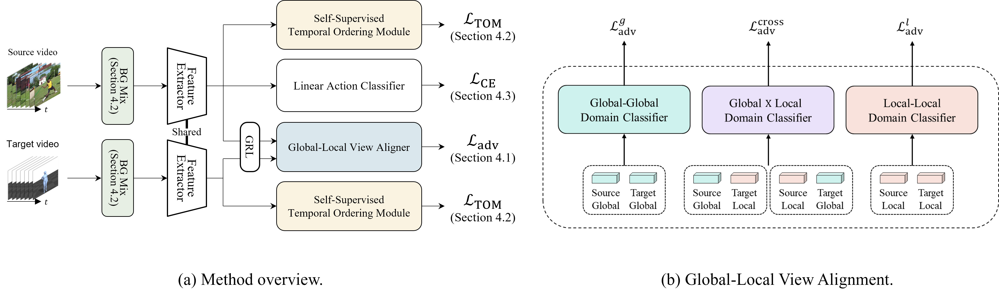

# GLAD: Global-Local View Alignment and Background Debiasing for Unsupervised Video Domain Adaptation with Large Domain Gap [WACV 2024]


## Installation
We provide our working conda environment as an exported yaml file.
```bash
conda env create --file requirements/environment.yml
pip install -e .
```

## Data Preparation

### 1. Download AMASS BMLrub Rendered Videos

The AMASS dataset is a comprehensive motion capture skeleton dataset that serves as an input for the [BABEL](https://babel.is.tue.mpg.de/index.html) dataset.
Unlike the original, our proposed dataset, Kinetics→BABEL, utilizes a different kind of input—rendered videos rather than skeletons.
To access these, please create an account on [AMASS](https://amass.is.tue.mpg.de/) and download the BMLrub rendered videos.


### 2. Link datasets

Make symlinks to the actual dataset paths.
```bash
mkdir data
ln -s ./data/k400 /KINETICS/PATH/
ln -s ./data/babel /BABEL/PATH/
```
We highly recommend to extract rawframes beforehand to optimize I/O.
Below are example structures for each dataset.

<details><summary>Kinetics Structure</summary>

```
./data/k400/rawframes_resized
├── train
│   ├── applauding
│   │   ├── 0nd-Gc3HkmU_000019_000029
│   │   │   ├── img_00000.jpg
│   │   │   ├── img_00001.jpg
│   │   │   ├── img_00002.jpg
│   │   │   └── ...
│   │   ├── 0Tq8uFakTbk_000000_000010
│   │   ├── 0XrsfW9ejfk_000000_000010
│   │   ├── 0YQrMye3BBY_000000_000010
│   │   ├── 1WMulo84kBY_000020_000030
│   │   └── ...
│   ├── balloon_blowing
│   ├── ...
│   ├── unboxing
│   └── waxing_legs
└── val
    ├── applauding
    ├── balloon_blowing
    ├── ...
    ├── unboxing
    └── waxing_legs
```
</details>

<details><summary>BABEL Structure</summary>

```
./data/babel
├── train
│   ├── 000000
│   │   ├── img_00001.jpg
│   │   ├── img_00002.jpg
│   │   └── ...
│   ├── 000002
│   └── ...
└── val
    ├── ...
    ├── 013286
    └── 013288
```
</details>

### 3. Extract Backgrounds for the Background Augmentation
```bash
python utils/extract_median_by_rawframes.py \
    --ann-file 'data/filelists/k400/filelist_k400_train_closed.txt' \
    --outdir 'data/median/k400' \
    --start-index 0 \
    --data-prefix 'data/k400/rawframes_resized'
```


## Train and Test

### Train
The training process has 2 stages.

1. TOL (Temporal Ordering Learning)
    ```bash
    source tools/dist_train.sh configs/tol.py 8 \
    --seed 0
    ```
    Then training result will be generated under `work_dirs/tol/`, which will be utilized in the next stage.
2. GLAD
    ```bash
    source tools/dist_train.sh configs/glad.py 8 \
    --seed 3 \
    --validate --test-last --test-best
    ```

### Test

```bash
source tools/dist_test.sh configs/glad.py $(find 'work_dirs/glad' -name '*best*.pth' | head -1) 8 \
--eval 'mean_class_accuracy' 'confusion_matrix'
```

## TODOs
- Model Zoo
- Kinetics→BABEL license check
- Pages in the citation


## License
This project is released under the [BSD-3-Clause](LICENSE).


## Citation
```bibtex
@inproceedings{leebae2024glad,
  title={{GLAD}: Global-Local View Alignment and Background Debiasing for Video Domain Adaptation},
  author={Lee, Hyogun and Bae, Kyungho and Ha, Seong Jong and Ko, Yumin and Park, Gyeong-Moon and Choi, Jinwoo},
  booktitle={Proceedings of the IEEE Winter Conference on Applications of Computer Vision (WACV)},
  year={2024}
}
```
